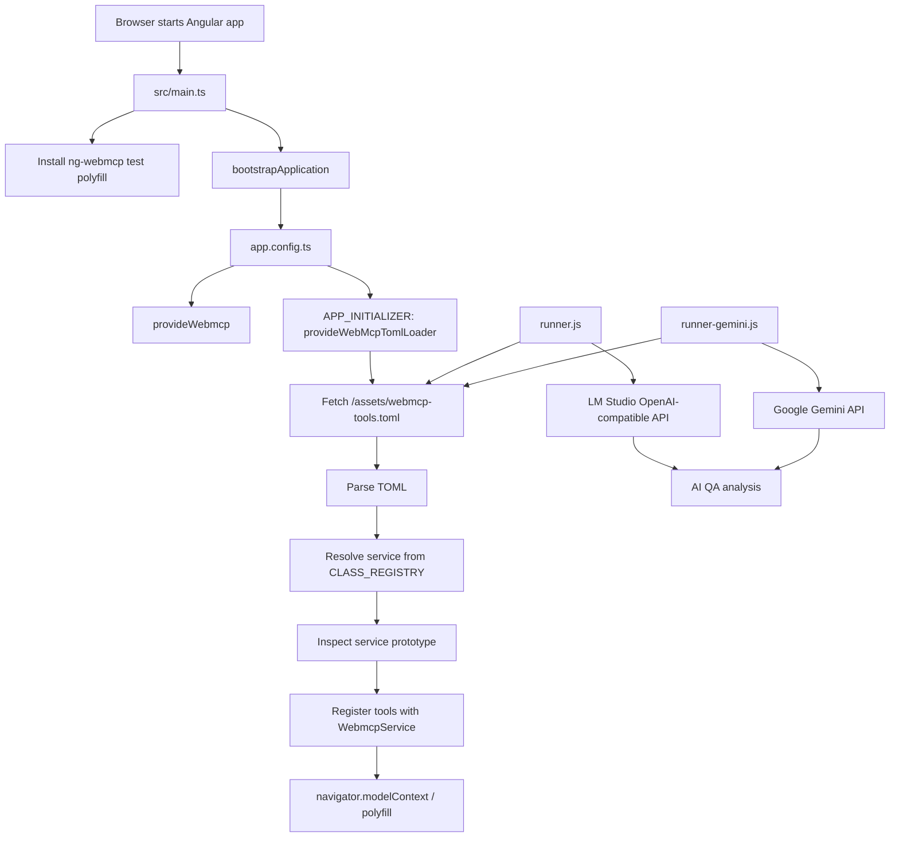

# Angular WebMCP QA Demo: Technical Guide

## 1. Purpose

This project is an Angular standalone application used to experiment with Web Model Context Protocol (WebMCP) tool registration and AI-assisted QA.

The application demonstrates four related ideas:

- Angular services can be exposed as browser tools through `ng-webmcp`.
- Tool exposure can be configured declaratively in TOML.
- An in-memory WebMCP polyfill can make the application testable in an environment without native `navigator.modelContext` support.
- A test plan can be evaluated by either a local model served by LM Studio or Google Gemini.

WebMCP support is experimental. The application currently relies on the `ng-webmcp` package and its testing polyfill rather than assuming that the browser provides a native WebMCP implementation.

## 2. System Overview



At runtime, the browser application registers tools during Angular initialization. The Node.js runners do not directly call the browser's registered tools. Instead, they fetch the TOML test plan and ask an LLM to reason about the declared tools, inputs, and expected assertions.

## 3. Runtime Startup

### 3.1 Package scripts

The main scripts are defined in `package.json`:

| Command | Purpose |
| --- | --- |
| `npm start` | Copies the TOML file and starts the Angular development server. |
| `npm run build` | Creates a production Angular build. |
| `npm test` | Runs Angular unit tests. |
| `npm run test:lm-studio` | Runs the local-model QA harness. |
| `npm run test:gemini` | Runs the Gemini QA harness. |
| `npm run mv:toml` | Copies `src/webmcp-tools.toml` to `public/assets/`. |

The project uses Angular 21, TypeScript 5.9, Node.js `fetch`, `smol-toml`, and `ng-webmcp`.

### 3.2 Angular bootstrap

`src/main.ts` performs two startup actions before bootstrapping Angular:

1. It assigns `window` to `global` for compatibility with the test polyfill.
2. It calls `installWebMcpPolyfill()` from `ng-webmcp/testing`.

Angular then bootstraps the standalone `App` component with `appConfig`.

### 3.3 Providers and initialization

`src/app/app.config.ts` registers:

- Angular browser error listeners.
- The application router.
- `provideWebmcp({ fallbackBehavior: 'warn' })`.
- `provideWebMcpTomlLoader()`.

The TOML loader is an `APP_INITIALIZER`. Angular waits for its returned async function to complete during application startup. If the TOML request fails, initialization throws an error and the application cannot finish starting normally.

## 4. TOML Loading and Tool Registration

The implementation lives in `src/webmcp-loader.ts`.

### 4.1 Class registry

The loader maps TOML class names to actual Angular service classes:

```ts
const CLASS_REGISTRY: Record<string, any> = {
  PaymentService,
  UserService,
};
```

Adding a service requires both:

1. Importing the service into `webmcp-loader.ts`.
2. Adding the class to `CLASS_REGISTRY` using the name referenced by TOML.

The services themselves use `@Injectable({ providedIn: 'root' })`, so Angular's `Injector` can resolve them as application-wide singletons.

### 4.2 Loading and parsing

The loader fetches:

```text
/assets/webmcp-tools.toml
```

It parses the response with `smol-toml`. Angular's asset configuration maps `src/webmcp-tools.toml` to the `assets` output directory. The `npm run mv:toml` script also copies the file to `public/assets` for development-server compatibility.

### 4.3 Method discovery

For each configured service, the loader obtains the instance from Angular's injector and inspects its prototype with `Reflect.ownKeys`.

The constructor is excluded. Remaining prototype properties are retained when their value is a function. This means the automatic strategy currently discovers methods declared directly on the service prototype; it does not derive JSON schemas from TypeScript parameter types.

### 4.4 Exposure modes

A tool entry supports two modes:

- `auto`: register every discovered service method.
- `explicit`: register only method names listed in `methods`.

The registered name is normalized to lowercase:

```text
<ClassName lowercase>_<method name lowercase>
```

Examples:

| Service method | WebMCP tool name |
| --- | --- |
| `UserService.login` | `userservice_login` |
| `UserService.getprofile` | `userservice_getprofile` |
| `PaymentService.processPayment` | `paymentservice_processpayment` |
| `PaymentService.applyDiscount` | `paymentservice_applydiscount` |

Each registered handler passes the tool arguments to the service method and serializes the result as WebMCP text content. Exceptions are converted into an error response with `isError: true`.

The current input schema is intentionally minimal:

```json
{
  "type": "object",
  "properties": {}
}
```

The schema does not currently describe required fields, field types, or validation constraints. Service methods perform their own runtime checks, where implemented.

## 5. Service Layer

### 5.1 `UserService`

`src/services/user.service.ts` exposes:

- `login({ user, pass })`: accepts the fixed demo credentials `test@example.com` and `ValidPass123`.
- `getprofile()`: returns the demo user's name and email.
- `logout()`: returns a successful response.

`deleteAccount` is deliberately absent. The test plan references `userservice_deleteaccount` to demonstrate missing-tool detection.

### 5.2 `PaymentService`

`src/services/payment.service.ts` exposes:

- `processPayment({ amount, card? })`: rejects the demo invalid card and negative amounts, but its current error message does not match every test expectation.
- `refund({ txId })`: returns a successful refund response without persistence.
- `applyDiscount({ amount, discount })`: currently subtracts the discount number directly from the amount. It is intentionally incorrect for a percentage discount.
- `getTransactionHistory()`: exists on the service but is excluded by the explicit TOML configuration.

These services are deliberately small and deterministic. They are demonstration fixtures, not production payment or authentication implementations.

## 6. TOML Configuration Contract

The file `src/webmcp-tools.toml` contains both tool exposure rules and QA test cases.

### 6.1 Tool declaration

```toml
[[tools]]
class = "UserService"
mode = "auto"

[[tools]]
class = "PaymentService"
mode = "explicit"
methods = ["processPayment", "refund", "applyDiscount"]

[tools.description_overrides]
processPayment = "Process a credit card payment securely"
```

Important behavior:

- `class` must match a key in `CLASS_REGISTRY`.
- `mode` must be `auto` or `explicit` for the intended behavior.
- `methods` matters for `explicit` mode.
- `description_overrides` changes the tool description without changing service code.
- Unknown classes are silently skipped by the current loader.

### 6.2 Test declaration

A test suite has a name, description, and ordered steps:

```toml
[[tests]]
name = "auth_flow_validation"
description = "Verify login success, profile retrieval, and logout cleanup."
steps = [
  { tool = "userservice_login", args = { user = "test@example.com", pass = "ValidPass123" }, assert = { success = true } },
  { tool = "userservice_getprofile", args = {}, assert = { name = "Test User" } }
]
```

Each step contains:

- `tool`: expected normalized tool identifier.
- `args`: object passed as the proposed tool input.
- `assert`: expected fields used by the AI evaluator when assessing the result.

The TOML is served as public data, so it should not contain secrets.

## 7. QA Runner Architecture

### 7.1 Shared flow

Both runners:

1. Fetch `http://localhost:4200/assets/webmcp-tools.toml`.
2. Parse the TOML.
3. Iterate over every test suite and step.
4. Build a prompt containing the declared tools, input arguments, and expected assertion.
5. Ask an LLM to return a pass/fail analysis and, for failures, a suggested TypeScript or TOML fix.
6. Print the model response to the terminal.

The runners are sequential and process each step independently. They do not persist test results or produce a machine-readable report.

### 7.2 LM Studio runner

`scripts/runner.js` uses the OpenAI-compatible LM Studio endpoint:

```text
http://localhost:1234/v1
```

It first queries `/models` and selects the first available model. If that request fails, it uses the fallback identifier `qwen3.5-4b-typescript-coder`.

Prerequisites:

- The Angular application is running on port 4200.
- LM Studio's local inference server is running on port 1234.
- An instruction-following model is loaded in LM Studio.

Run it with:

```bash
npm run test:lm-studio
```

### 7.3 Gemini runner

`scripts/runner-gemini.js` uses `@google/generative-ai` and reads either `GEMINI_API_KEY` or `API_KEY` from the environment.

Run it with:

```bash
GEMINI_API_KEY="your_key_here" npm run test:gemini
```

The configured model identifier is `gemini-3.5-flash`. The runner still requires the Angular application to be available at port 4200 because it fetches the test plan from the running app.

### 7.4 What the runners do not verify

The current runners do not:

- Invoke `navigator.modelContext` directly.
- Execute the registered service methods in the browser.
- Compare a live tool response with an assertion in code.
- Verify that the browser's registry contains the tool at runtime.
- Guarantee that an LLM's suggested fix is correct.

They are AI-assisted static/semi-dynamic QA reviewers. A stronger end-to-end test would add a browser automation client that inspects the actual WebMCP registry and invokes tools against the running Angular page.

## 8. Intentional Failure Fixtures

The TOML includes failures that are useful for demonstrating analysis output:

| Test | Expected issue |
| --- | --- |
| `payment_buggy_discount_test` | `applyDiscount` returns `185` for `200` with a 15 percent discount instead of `170`. |
| `userservice_missing_tool_test` | `userservice_deleteaccount` has no corresponding service method or registration. |
| `negative_payment_validation` | The service returns `Invalid Card or Amount`, while the test expects `Amount must be greater than zero`. |
| `missing_auth_param_validation` | `login` does not explicitly return the expected `Username is required` error when `user` is absent. |

The passing suites cover the happy-path authentication flow and invalid-card handling as currently described by the fixture behavior.

## 9. Local Development

From the `app` directory:

```bash
npm install
npm start
```

Open `http://localhost:4200` after the server starts.

Run the Angular unit tests separately:

```bash
npm test
```

To run an AI QA harness, keep the Angular server running in one terminal and use the appropriate runner in another terminal.

## 10. Adding a New WebMCP Service

1. Create an Angular injectable service under `src/services`.
2. Mark it with `@Injectable({ providedIn: 'root' })`.
3. Add the service import and class entry to `CLASS_REGISTRY` in `src/webmcp-loader.ts`.
4. Add an `[[tools]]` entry to `src/webmcp-tools.toml`.
5. Use `mode = "explicit"` when only a stable public subset should be exposed.
6. Add tool descriptions and test cases to the TOML.
7. Add unit tests for service behavior and, where possible, an integration test for registration.
8. Start the app and confirm the TOML is available at `/assets/webmcp-tools.toml`.

For methods that accept structured input, update `inputSchema` generation before relying on an AI agent to discover the contract. The current loader's empty schema is suitable only for this demonstration.

## 11. Operational and Security Considerations

- Do not expose real credentials, payment data, or API keys in the TOML or demo services.
- Treat tool descriptions and test plans as untrusted public input.
- Validate tool arguments inside every service method; the current schema is not a validation boundary.
- Consider allowlisting methods explicitly for production use.
- Avoid silently ignoring unknown classes or methods in production; report configuration errors clearly.
- Keep Gemini and LM Studio credentials in environment variables, never in source files.
- Add origin, authentication, authorization, and audit controls before exposing tools that mutate real application state.

## 12. Current Limitations and Recommended Next Steps

The project is intentionally experimental. The most valuable next improvements are:

1. Generate JSON schemas from a typed tool definition rather than registering an empty object schema.
2. Add browser-level tests that inspect and invoke the actual registered tools.
3. Make the test runners compare structured results instead of relying only on model judgment.
4. Return consistent validation errors from services and align the TOML assertions with those contracts.
5. Fail fast for unknown classes, missing methods, duplicate tool names, and malformed TOML entries.
6. Replace `any` in the loader with typed configuration, service, and WebMCP response models.
7. Add persisted test output in JSON or JUnit format for CI use.
